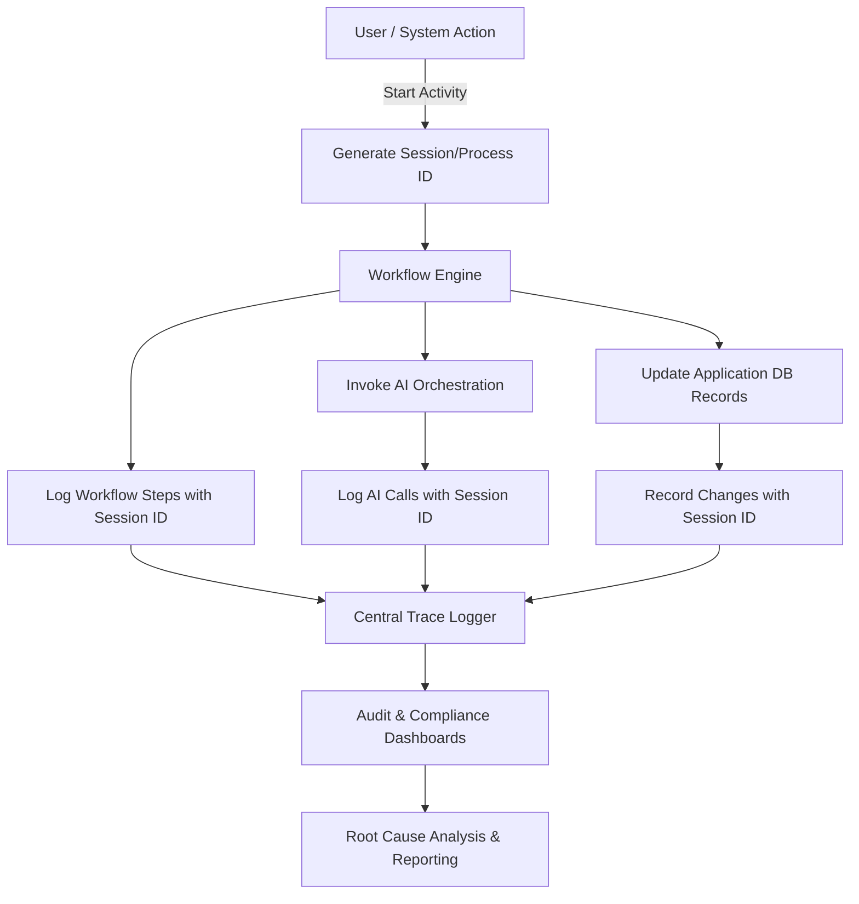

### 🔄 Session/Process ID Traceability Enhancement

* **Unique session/process ID** assigned at activity start, propagated through workflows, AI calls, and data changes
* Logs workflow runs with session ID, step IDs, user, trigger source, timestamps, and status
* AI calls tagged with session ID including prompt, response, model, confidence, and audit metadata
* Database tables extended with fields for `session_id`, `changed_by_user_id`, `change_timestamp`
* Immutable audit logs capture detailed record changes keyed by session ID, change type, and previous/new values
* Central trace logger aggregates all session-bound logs for audit, compliance, root cause, and reporting purposes

---

---

### 🔄 Session/Process ID Traceability Enhancement

#### 1. **Session/Process ID Concept**

* A **unique session or process ID** is generated at the start of any user or system-triggered activity.
* This ID **propagates across all subsequent workflows, steps, AI calls, and database changes** related to that activity.
* Enables **complete correlation** of:

  * UI interactions
  * Workflow executions
  * AI decision traces
  * Database record changes
  * External system events (e.g., webhooks)

#### 2. **Logging Requirements**

* Every **workflow run event** logs the session/process ID with:

  * Workflow and step identifiers
  * User and role context
  * Trigger source and type
  * Timestamps and status changes
* Every **AI invocation** associates with the same session ID, linking:

  * Prompt and response logs
  * Model and config used
  * Confidence and explainability metadata
* Application **database tables** that undergo state or content changes record:

  * Session/process ID of the triggering context
  * User performing the change (if applicable)
  * Timestamp of the change
  * Audit trail for rollback or compliance review

#### 3. **Database Accommodation**

* Extend key tables with additional columns:

  * `session_id UUID` or `process_id UUID`
  * `changed_by_user_id UUID`
  * `change_timestamp TIMESTAMP WITH TIMEZONE`
* Introduce an **immutable audit log table** for detailed record history with:

  * `record_id`
  * `session_id`
  * `change_type` (insert/update/delete)
  * `changed_fields` JSONB
  * `previous_values` JSONB
  * `new_values` JSONB

#### 4. **Integration with Trace Logger & Audit Layer**

* The trace logger centralizes collection of all session-bound logs from:

  * Workflow engine events
  * AI orchestrator invocations
  * Database audit trail events
* Provide queryable views and dashboards for:

  * Full path analysis of an activity
  * Compliance reporting
  * Incident investigation and root cause analysis

